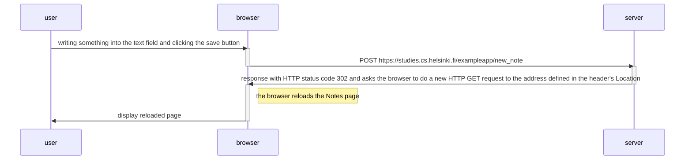

# part0
0.4

```mermaid
sequenceDiagram
    participant user
    participant browser
    participant server

    user->>browser: writing something into the text field and clicking the save button
    activate browser
    browser->>server: POST https://studies.cs.helsinki.fi/exampleapp/new_note
    deactivate browser
    activate server
    server->>browser: response with HTTP status code 302 and asks the browser to do a new HTTP GET request to the address defined in the header's Location
    deactivate server
    activate browser
    Note right of browser: the browser reloads the Notes page
    browser->>user: display reloaded page
    deactivate browser
```
