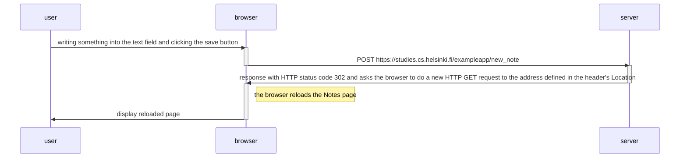
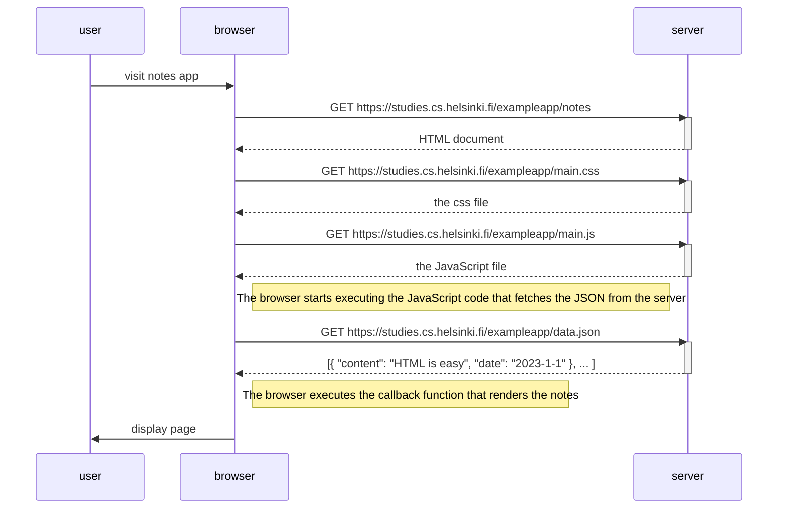
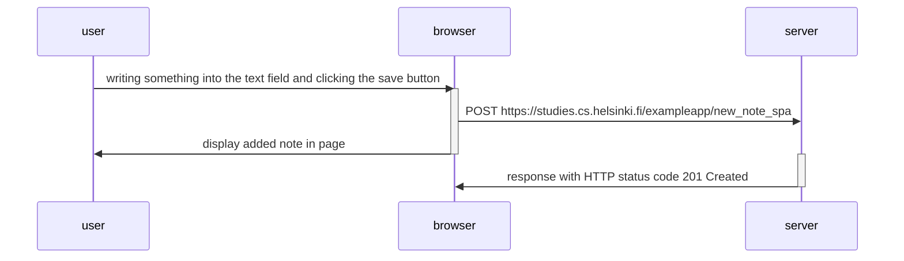

# part0
0.4

```mermaid
sequenceDiagram
    participant user
    participant browser
    participant server

    user->>browser: writing something into the text field and clicking the save button
    activate browser
    browser->>server: POST https://studies.cs.helsinki.fi/exampleapp/new_note
    deactivate browser
    activate server
    server->>browser: response with HTTP status code 302 and asks the browser to do a new HTTP GET request to the address defined in the header's Location
    deactivate server
    activate browser
    Note right of browser: the browser reloads the Notes page
    browser->>user: display reloaded page
    deactivate browser
```
0.5 (Same as the MPA)

```mermaid
sequenceDiagram
    participant user
    participant browser
    participant server

    user->>browser: visit notes app
    browser->>server: GET https://studies.cs.helsinki.fi/exampleapp/notes
    activate server
    server-->>browser: HTML document
    deactivate server

    browser->>server: GET https://studies.cs.helsinki.fi/exampleapp/main.css
    activate server
    server-->>browser: the css file
    deactivate server

    browser->>server: GET https://studies.cs.helsinki.fi/exampleapp/main.js
    activate server
    server-->>browser: the JavaScript file
    deactivate server

    Note right of browser: The browser starts executing the JavaScript code that fetches the JSON from the server

    browser->>server: GET https://studies.cs.helsinki.fi/exampleapp/data.json
    activate server
    server-->>browser: [{ "content": "HTML is easy", "date": "2023-1-1" }, ... ]
    deactivate server

    Note right of browser: The browser executes the callback function that renders the notes

    browser->>user: display page
```
0.6

```mermaid
sequenceDiagram
    participant user
    participant browser
    participant server

    user->>browser: writing something into the text field and clicking the save button
    activate browser
    browser->>server: POST https://studies.cs.helsinki.fi/exampleapp/new_note_spa
    browser->>user: display added note in page
    deactivate browser
    activate server
    server->>browser: response with HTTP status code 201 Created
    deactivate server
```
